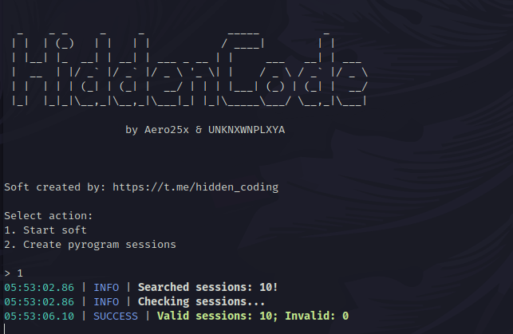

[](https://t.me/hidden_coding)




## Recommendation before usage

# 🔥🔥 use PYTHON 3.10 🔥🔥


### English

# BlumBot Telegram Automation

BlumBot is a Telegram automation tool designed to help you manage and interact with BlumCryptoBot. This bot can create sessions, gather statistics, and automate tasks for your accounts.

### Features
- Create Pyrogram sessions
- Gather and save statistics
- Automate interaction with BlumCryptoBot

### Installation

#### 

1. **Clone the repository:**
    ```bash
    git clone https://github.com/D4rkKaizen/telegram-blum-auto.git
    cd telegram-blum-auto
    ```

2. **Run script:**
	Double-click on the `run.bat` (windows) or `bash run.sh` (linux or macos) 

### Configuration

Edit the `data/config.py` file with your `API_ID` and `API_HASH`.

```python
API_ID = 'your_api_id'
API_HASH = 'your_api_hash'
```
get ID and API_HASH here -> my.telegram.org

### Usage


1. **Run the script:**
    ```run.bat``` or ```run.sh```

2. **Select an action:**
    - `1` create session
    - `2` run clicker

### Directory Structure

```plaintext
.
├── data
│   ├── config.py
│   ├── proxy.txt
│   └── __pycache__
├── main.py
├── README.md
├── requirements.txt
├── run.bat
├── run.sh
└── utils
    ├── blum.py
    ├── core
    ├── __pycache__
    ├── starter.py
    └── telegram.py
```

### Contact

For support or questions, contact me on Telegram: [@hidden_coding](https://t.me/hidden_coding)

---

### Русский

# 🔥🔥 используй PYTHON 3.10 🔥🔥


# BlumBot Автоматизация для Telegram

BlumBot - это инструмент автоматизации для Telegram, разработанный для помощи в управлении и взаимодействии с BlumCryptoBot. Этот бот может создавать сессии, собирать статистику и автоматизировать задачи для ваших аккаунтов.

### Функции
- Создание сессий Pyrogram
- Сбор и сохранение статистики
- Автоматизация взаимодействия с BlumCryptoBot

### Установка

1. **Клонируйте репозиторий:**
    ```bash
    git clone https://github.com/D4rkKaizen/telegram-blum-auto.git
    cd telegram-blum-auto
    ```

2. **Запустите скрипт:**
    Дважды щелкните по файлу `run.bat` если у вас Windows или выволпните команду `sh run.sh` если у вас Unix-система

### Конфигурация

Отредактируйте файл `data/config.py`, добавив ваши `API_ID` и `API_HASH`.

```python
API_ID = 'your_api_id'
API_HASH = 'your_api_hash'
```
получить ID и API_HASH тут -> my.telegram.org

### Использование

#### Для пользователей Windows

1. **Запустите скрипт:**
    ```run.bat``` или ```run.sh```

2. **Выберите действие:**
    - `1` чтобы создать сессии Pyrogram
    - `2` чтобы запустить бота

### Структура каталогов

```plaintext
.
├── data
│   ├── config.py
│   ├── proxy.txt
│   └── __pycache__
├── main.py
├── README.md
├── requirements.txt
├── run.bat
├── run.sh
└── utils
    ├── blum.py
    ├── core
    ├── __pycache__
    ├── starter.py
    └── telegram.py
```

### Контакт

Для поддержки или вопросов свяжитесь со мной в Telegram: [@hidden_coding](https://t.me/hidden_coding)
